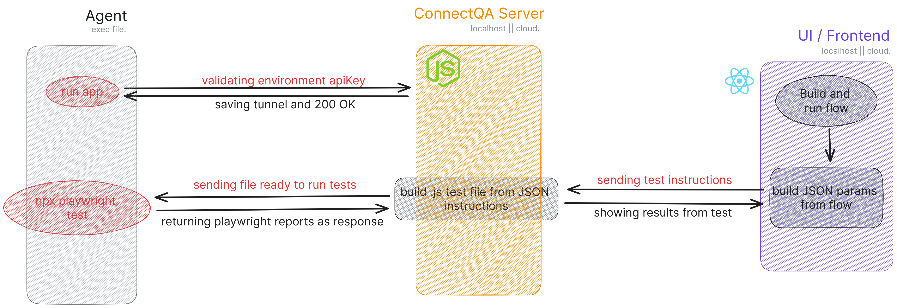

# ConnectQA Agent

The repository for the ConnectQA runner agent. Built in TypeScript. 

## Architecture

This schematic represents the basic flows that the ConnectQA agent deals with.

## How it works?

ConnectQA allows you to run your tests directly on your computer without writing code. You make it easy and simple from a UI (coming soon).

When you develop the flows, they will be sent to the ConnectQA server where, once you have linked an agent to your account and it is available to receive tests, it will receive all the instructions to run it on that computer, being able to be anywhere in the world.

This in turn allows you to run your tests using your computing power, making this process free forever.

## How to collaborate?

Please feel free to make any contribution you wish. There are not many free no-code testing tools in the world and our goal is to change that. You can send your PR and we will gladly review it together.
